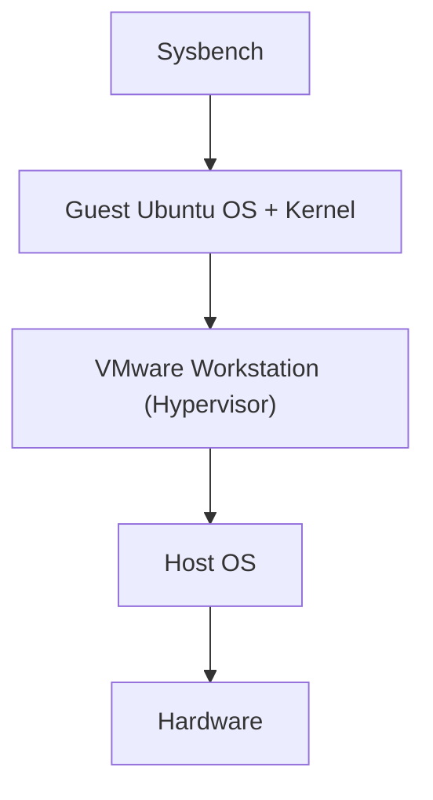
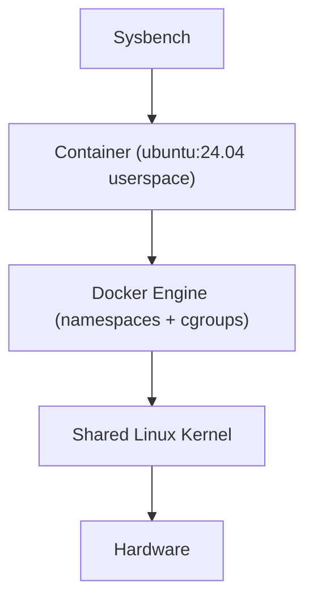

# Experiment 2  Memory Performance: Virtual Machine vs Docker Container

[](#)
[](#)
[](#)
[](#)

---

## Executive Summary

This experiment compares memory-operation performance of an **Ubuntu Virtual Machine (VMware Workstation)** and a **Docker container** (`vm-container-benchmark`, based on `ubuntu:24.04`) using the identical Sysbench memory workload (1 MiB blocks, 10 GiB total, 4 threads, write).

### Key Finding

> **The Docker container reached 123,725.89 MiB/sec versus 108,900.87 MiB/sec for the VM – a +13.61% throughput advantage – and a maximum latency of 1.13 ms versus 3.04 ms (-62.8%).**

---
## 1. Objectives

1. **Environment setup** – Prepare an Ubuntu VM and a Docker benchmark image with the same tooling (`sysbench 1.0.20`).
2. **Controlled workload** – Run an identical Sysbench memory test in both environments.
3. **Metric collection** – Record operations/sec, MiB/sec transfer rate, total time and latency (min, avg, max, 95th percentile).
4. **Evaluation** – Compare the overhead of full hardware virtualization (VM) with OS-level virtualization (container) for memory-bound work.

---

## 2. VM vs Container Architecture

A **VM** boots its own guest kernel on top of a hypervisor; a **container** is an isolated process group (namespaces + cgroups) that shares the host kernel.

**Virtual Machine**



**Docker Container**



```
   VM                                   Container
+--------------------------+         +--------------------------+
| Sysbench                 |         | Sysbench                 |
| Guest OS (own kernel)    |         | Container userspace      |
| Hypervisor (VMware)      |         | Docker Engine            |
| Host OS                  |         | Host OS / Linux kernel   |
| Hardware                 |         | Hardware                 |
+--------------------------+         +--------------------------+
```

| Aspect | Virtual Machine | Container |
|---|---|---|
| Isolation | Hardware-level (separate kernel) | Process-level (shared kernel) |
| Startup | Seconds–minutes | Milliseconds–seconds |
| Memory overhead | Full guest OS RAM | Only app + libraries |
| Memory access path | Guest → hypervisor (EPT/NPT) → host | Direct host kernel memory management |

---

## 3. Environment Specifications

| Parameter | VM | Docker Container |
|---|---|---|
| Platform | Ubuntu on VMware Workstation (`vm01-VMware-Virtual-Platform`) | Docker on the same Ubuntu VM |
| Base OS | Ubuntu 24.04 LTS | `ubuntu:24.04` image |
| Benchmark tool | Sysbench 1.0.20 (LuaJIT 2.1.0-beta3) | Sysbench 1.0.20 (LuaJIT 2.1.0-beta3) |
| Threads | 4 | 4 |
| Memory block size | 1 MiB | 1 MiB |
| Total memory transferred | 10 GiB | 10 GiB |
| Operation / scope | write / global | write / global |

> The lab manual recommends a controlled configuration (4 vCPU, 8 GB RAM, 60 GB disk; container limits `--cpus=4 --memory=8g`). Verify with `nproc`, `free -h` and `lsblk`, and record the actual values in `docs/`.

---

## 4. Experimental Procedure

### Step 1: Record the environment

```bash
cd ~/vm-vs-container-performance
mkdir -p docs results/raw results/processed results/figures scripts workloads
lscpu   > docs/cpu-info.txt
free -h > docs/memory-info.txt
lsblk   > docs/storage-info.txt
uname -a > docs/kernel-info.txt
docker --version
```

### Step 2: Install tools inside the VM

```bash
sudo apt update && sudo apt upgrade -y
sudo apt install -y sysbench fio iperf3 htop sysstat python3 python3-pip git
sysbench --version
nproc && free -h
```

### Step 3: Build the benchmark container image

Dockerfile ([`docker/Dockerfile`](docker/Dockerfile)):

```dockerfile
FROM ubuntu:24.04
RUN apt-get update && \
    apt-get install -y sysbench fio iperf3 python3 python3-pip procps sysstat && \
    rm -rf /var/lib/apt/lists/*
WORKDIR /benchmark
```

```bash
docker build -t vm-container-benchmark -f docker/Dockerfile .
docker images
```
